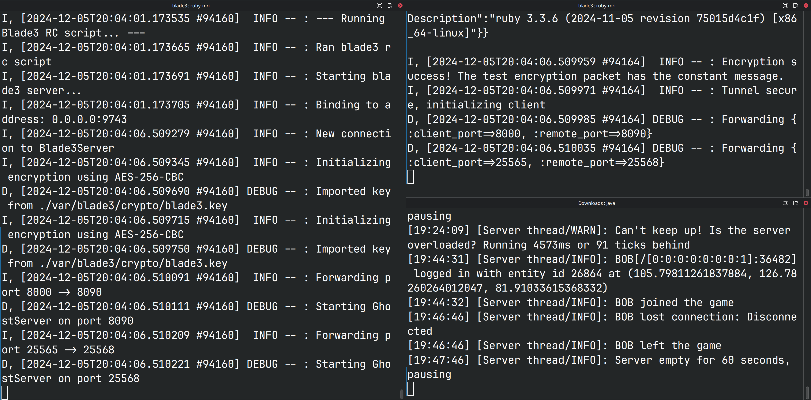

# Blade<sup>3</sup>
Port forwarding tool


## About
Blade3 forwards local services to remote servers over an encrypted tunnel. SSH not required.

## Install
```bash
/usr/bin/env ruby -e "$(curl -fsSL https://install.blade3.xyz/install.rb)"
```
## Getting Started
For more information see the [Blade3 documentation](https://blade3.xyz/docs)